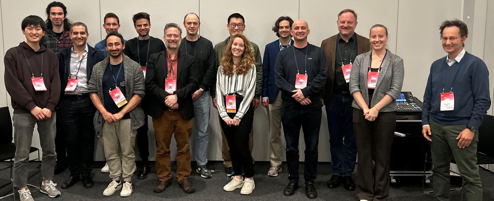

#  Tensegrity Robotics: Toward Field-capable, Intelligent Systems

## IROS - Pittsburgh, PA, USA

## September 27, 2026

<video autoplay loop muted width="100%" src="img/tensegrity_compilation.mp4" controls="controls">
</video>

## Organizers:

* Will Johnson (Yale University)
* John Rieffel (Union College) 
* Xiaonan (Sean) Huang (University of Michigan)
* Kostas Bekris (Rutgers University)
* Valter Böehm (OTH Regensburg)
* Muhao Chen (University of Houston)
* Lauren Ervin (Florida International University)
* Rebecca Kramer-Bottiglio (Yale University)
* Vishesh Vikas (University of Alabama)

This will be the sixth in a series of Tensegrity Robotics workshops we’ve been organizing since 2018. Please address correspondence to Will Johnson at [wjohnso3@swarthmore.edu](mailto:wjohnso3@swarthmore.edu).

## Abstract 
Composed of rigid struts and compliant tendons, tensegrity robots boast a remarkable strength-to-weight ratio and demonstrate extraordinary shape morphability, stiffness tuning, and impact resistance. These favorable properties make tensegrity robots an attractive technology for the next generation of adaptive robots. However, tensegrity robots’ compliance, coupled dynamics, and many degrees of freedom pose challenges in modeling, sensing, and control. Demonstrations of tensegrity robots are typically confined to a controlled laboratory setting despite claims of tensegrity robots’ favorability for remote and unstructured environments. To solve this grand challenge, this workshop aims to rally the tensegrity robotics community to build **field-capable, intelligent systems**.  This workshop draws participation from tensegrity roboticists in industry as well as researchers and experts in complementary fields, including field robotics, robot learning, soft robot modeling and control, and bio-inspired robotics. The workshop will give participants an opportunity to present and discuss the current state of the art in tensegrity robotics through invited talks, live robot demonstrations, an interactive panel discussion, and a student-focused poster session.  The organizers will disseminate the results of the workshop discussions in a prospective article and summarize them on the tensegrity robotics website.  This workshop will attract and engage new participants in the field, encourage interactions between junior and senior researchers, and facilitate future collaborations.

## Schedule
(all times in EDT)

* 08:30 - 08:40 Opening Remarks
* 08:40 - Invited Talks
	* 08:40 - **Shuhei Ikemoto** *Design and Modeling of Redundant Tensegrity Manipulators*
	* 09:00 - **Robert Baines** *Leaps and Bounds: Design and Control of Jumping Tensegrity Robots*
	* 09:20 - **Luyang Zhao** *Toward Task-Adaptive Soft Modular Tensegrity Robots*
	* 09:40 - **Hiroyuki Nabae** *Multi-modal Locomotion in Pneumatically Actuated Tensegrity Robots*
	* 10:00 - **Cole Woods** *The Second Spine: From Research to Reality in Tensegrity Commercialization*
* 10:20 - Student Spotlight Talks
* 10:30 - Morning Coffee Break
* 11:00 - Live Demo Session
* 11:30 - **Xuesu Xiao** *Learning Extreme Off-Road Mobility* 
* 11:50 - Panel Discussion
* 12:20 - Closing Remarks 
* 12:30 - End

## Contribute

We are soliciting contributions for poster presentations and live demonstrations.  We especially encourage participants to present live demonstrations if possible.  Submissions do not need to specifically focus on tensegrity robots, but they should be of interest to the tensegrity robotics community. We welcome contributions from tensegrity robotics as well as complementary fields such as field robotics, robot learning, soft robot modeling and control, and autonomous systems.  Expert panelists will choose a **Best Demo Award** and **Best Poster Award**.

Those interested should submit a one-page abstract in IEEE conference format using [this form](https://forms.gle/3Wy92WJYHbLB1YkJ9). Templates are available for download through the [IEEE Template Selector](https://template-selector.ieee.org/secure/templateSelector/publicationType). Authors may also include a link to supplementary materials, such as videos, project websites, or code repositories.

The early-bird submission deadline is **Monday, July 20th, 2026 AoE**. Submissions received by this deadline will receive a decision before the IROS early registration deadline (July 24th). Regular submissions are due **Monday, August 17th, 2026 AoE**.  Regular submissions will receive a decision by Monday, August 24th, 2026.

We especially encourage submissions from students, early-career researchers, underrepresented groups, new conference attendees, and researchers from adjacent fields who are interested in engaging with the tensegrity robotics community.

## Inclusiveness

We want to specifically encourage participation from students, young researchers, underrepresented groups, new conference attendees, and those who have not participated in a workshop before.  Once the solicitation opens, please submit your research so that it can enrich our workshop.  The poster session is meant to highlight the work of students and young researchers.  You are welcome as a contributor and/or as an attendee.

## Prior Workshops

<!--  -->

An archive of the workshop series we've been running since 2018.

* [RoboSoft 2025](prior_workshops)
* [IROS 2023](https://www.eng.yale.edu/faboratory/tensegrityworkshop/)
* [RoboSoft 2022](https://muse.union.edu/tensegrity/)
* [ICRA 2019](https://muse.union.edu/tensegrity/icra-2019/)
* [RoboSoft 2018](https://muse.union.edu/robosoft-tensegrity-workshop/)